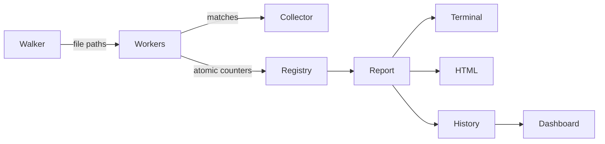

# SCP (Scope)

[](https://pkg.go.dev/github.com/Viswesh-G/scope)
[](https://github.com/Viswesh-G/scope/actions/workflows/ci.yml)

**Scope is a fast, local-first codebase intelligence tool.**

It started as a small `grep`-style search engine and is growing into a practical developer tool that helps you:

- find text and Go declarations quickly;
- understand repository structure and dependencies;
- measure how parallel work was performed;
- keep a history of searches and performance;
- work from the CLI, terminal UI, or local web dashboard.

The project is written in Go and is designed to stay understandable, measurable, and useful from a normal terminal.

## Product vision

Scope answers more than “where is this text?” It also helps answer:

- Which files contain the most matches?
- How much work did each worker perform?
- Was the search workload balanced?
- Which searches are slow or frequently repeated?
- What is the structure and dependency shape of this repository?

The long-term direction is a **local-first developer intelligence platform** with four pillars:

1. **Find**: literal, regular-expression, filename, and structural searches.
2. **Understand**: repository graphs, dependencies, duplicates, and hotspots.
3. **Measure**: throughput, parallelism, profiling, and benchmark comparisons.
4. **Monitor**: search history, file watching, dashboards, and health checks.

## Install

With Go 1.25 or newer:

```bash
go install github.com/Viswesh-G/scope@latest
```

The installed command is named `scp`.

From a checkout, use the Makefile:

```bash
make build
make test
make check
```

`make check` runs formatting checks, vet, vulnerability scanning when `govulncheck` is installed, and tests. The GitHub Actions workflow runs the same quality gates on Linux and Windows.

## Quick start

```bash
# Search the current directory
scp search -p "TODO"

# Search a specific directory, ignoring case
scp search -p "func main" --path ./cmd -i

# Show context around matches
scp search -p "TODO" -C 2

# Search only Go files and skip tests
scp search -p "FIXME" -g "*.go" -g "!*_test.go"

# Search standard input
cat app.log | scp search -p "FATAL" --path -

# Produce machine-readable output
scp search -p "error" --json -q

# Open the interactive terminal UI
scp tui
```

## Commands

### Search

`scp search` is the main command. It uses a filesystem walker, a pool of worker goroutines, and a collector that renders results.

```bash
scp search -p "pattern"
scp search -p "pattern" --count
scp search -p "pattern" --hotspots
scp search -p "pattern" --max-results 20
scp search -p "pattern" --output matches.txt --quiet
scp search -p "pattern" --html report.html
scp search -p "pattern" --profile
scp search -p "pattern" --parallel-profile
```

Important flags:

| Flag | Purpose |
| --- | --- |
| `-p, --pattern` | Regular-expression pattern; required |
| `--path` | Directory to search, or `-` for standard input |
| `-i, --ignore-case` | Match without case sensitivity |
| `-w, --workers` | Number of parallel workers |
| `-f, --fname` | Match filenames instead of file contents |
| `--hotspots` | Rank files by match count |
| `--count` | Print only the total match count |
| `-m, --max-results` | Stop displaying after a maximum number of matches |
| `-A, -B, -C` | Show trailing, leading, or both context lines |
| `-g, --glob` | Include or exclude files with globs |
| `-q, --quiet` | Suppress the metrics report |
| `--json` | Emit a JSON array for scripts and pipelines |
| `--html` | Write a standalone HTML report |
| `--profile` | Write CPU and memory profiles to `.scope/` |

### Structural Go search

`scp ast` uses Go's parser instead of matching raw text. This avoids matches inside comments and strings.

```bash
scp ast --type func
scp ast --type func --name "handle*"
scp ast --type struct --path ./internal
scp ast --type interface --name "*er"
```

Supported node types are `func`, `struct`, `interface`, `var`, `const`, and `type`.

### Repository analysis

```bash
scp audit                 # stats + dependencies + duplicate files
scp stats                 # file extensions
scp deps                  # Go import counts
scp dupes                 # identical files by SHA-256
scp graph                 # terminal directory tree
scp graph --dot > graph.dot
```

### History and monitoring

Every normal search is recorded in `.scope/history.json`, capped at 1000 entries.

```bash
scp history
scp history stats
scp history top
scp history slowest
scp history recent --limit 25
scp history replay
scp history export -o history.json
scp history clear
```

For an editor-friendly live search:

```bash
scp watch -p "TODO"
```

The watcher debounces bursts of filesystem events before starting another search.

### Terminal UI

Run:

```bash
scp tui
```

The TUI provides search input, path and flag controls, result navigation, status feedback, and help. It uses the same search command as the CLI, so CLI options can be entered in the flags field.

Useful examples:

```text
Pattern: TODO
Path:    .
Flags:   -i -C 2 -g *.go
```

Results can also be piped into the TUI:

```bash
scp search -p "error" --json -q | scp tui
```

Use `Tab` to change tabs, `Up`/`Down` to move between fields or scroll results, `Enter` to search, and `Esc` or `Ctrl+C` to exit.

### Live dashboard

Start the local dashboard with:

```bash
scp serve
scp serve --port 3000
```

Open `http://localhost:8080`. The dashboard reads search history and receives new records through Server-Sent Events. It is intended for local development, not public hosting.

### Configuration and ignore rules

```bash
scp config list
scp config set-color match red
scp config reset

scp ignore init
scp ignore add "*.log"
scp ignore remove "*.log"
scp ignore list
```

Scope skips common generated, dependency, binary, and media files by default. A repository can add `.scope-ignore` patterns using the same simple line-based style as `.gitignore`.

## Architecture



The main packages are:

| Package | Responsibility |
| --- | --- |
| `cmd/` | Cobra commands and flag parsing |
| `internal/search/` | Concurrent search pipeline |
| `internal/metrics/` | Atomic counters and worker reports |
| `internal/analysis/` | History, repository statistics, duplicates, and graphs |
| `internal/ast/` | Go structural search |
| `internal/output/` | Terminal tables, colors, and HTML reports |
| `internal/tui/` | Bubble Tea terminal interface |
| `internal/serve/` | Local HTTP API, SSE, and embedded dashboard |
| `internal/watch/` | Debounced filesystem watching |
| `internal/ignore/` | Built-in and repository ignore rules |
| `internal/profiler/` | CPU, memory, and flamegraph output |

## Performance approach

Scope is optimized around practical workloads rather than clever-looking benchmarks:

- literal patterns use `strings.Contains` instead of the regex engine;
- file paths are distributed across worker goroutines;
- shared counters use atomics;
- worker event slices use small, protected critical sections;
- binary and ignored files are skipped before scanning;
- benchmark results use repeated runs, warmups, percentiles, and variance;
- `--profile` exposes CPU and memory behavior when a workload needs investigation.

Use the comparison command when `rg` is installed:

```bash
scp compare -p "github" --runs 20 --warmup 3
```

Scope is not expected to beat ripgrep on every workload. The goal is to make the trade-offs measurable and the implementation easy to improve.

## Development

Requirements:

- Go 1.25 or newer
- Make
- Graphviz is optional and is used for profile SVGs
- `rg` is optional and is used by `scp compare`
- `govulncheck` is optional locally but used by the security check

Useful commands:

```bash
make build
make test
make race
make vet
make bench
make cover
make check
```

See [`CONTRIBUTING.md`](CONTRIBUTING.md) for the development workflow. The project intentionally keeps the CLI layer thin and puts behavior in testable `internal/` packages.

## Current boundaries

Scope is a local developer tool. The dashboard binds locally by default and its history is stored on disk. It is not yet a replacement for a hosted code search service, a full language server, or a multi-user observability backend.

The next major direction is richer symbol indexing and cross-language structural search while keeping the local-first, understandable, performance-measured design.
