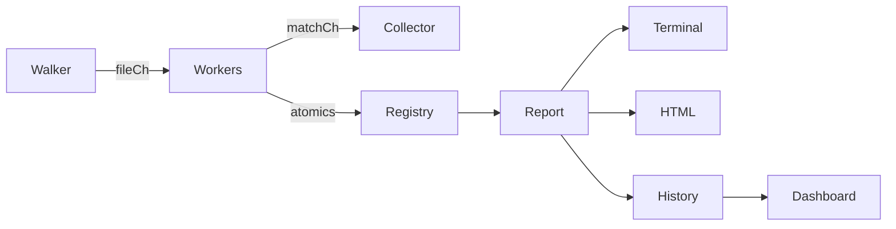

# SCP (Scope)

[](https://pkg.go.dev/github.com/Viswesh-G/scope)
[](https://github.com/Viswesh-G/scope/actions/workflows/ci.yml)
[]()

A fast, concurrent, self-profiling search engine — built from scratch in Go!

SCP works like `ripgrep` or `grep`: it searches files for regex patterns. But it also **instruments itself** — after every search it shows you exactly where time went: which workers scanned which files, how much data was processed, how evenly the work was distributed, and what the parallelism ratio was.

It can also profile itself with Go's built-in `pprof` (generating easy-to-read SVG flamegraphs), export beautiful HTML reports, run a live dashboard, and benchmark itself head-to-head against ripgrep.

---

## Quick Start & Installation

You can install SCP directly using Go:

```bash
go install github.com/Viswesh-G/scope@latest
```

Try it out immediately:

```bash
# Search the current directory for "TODO"
scp search -p "TODO"

# Open the Interactive Terminal UI
scp tui

# Start the Live Dashboard to track your search history!
scp serve --port 8080

# Generate a beautiful HTML report
scp search -p "func" --html report.html

# Profile the search and generate SVG flamegraphs automatically!
scp search -p "func" --profile

# Benchmark scp against ripgrep (requires rg on PATH)
scp compare -p "github" --runs 20

# Show 2 lines of context around each match (like grep -C 2)
scp search -p "TODO" -C 2

# Only search Go source, skip test files
scp search -p "FIXME" -g "*.go" -g "!*_test.go"

# Machine-readable JSON output (great for piping to jq)
scp search -p "error" --json -q

# Search stdin directly
cat app.log | scp search -p "FATAL" --path -
```

---

## Commands Overview

| Command | What it does |
|---|---|
| `scp search` | Search files for a regex pattern. Supports `--html`, `--json`, `-A/-B/-C`, `-g`, `--profile` and more |
| `scp tui` | Open the interactive terminal UI |
| `scp serve` | Starts a Live Dashboard on `localhost:8080` to view search history |
| `scp compare` | Benchmark scp vs ripgrep head-to-head |
| `scp audit` | File stats + Go imports + duplicate files, all in one shot |
| `scp history` | View recent searches and metrics in the terminal |
| `scp stats` / `deps` / `dupes` / `graph` | Deep-dive codebase analysis tools |
| `scp config` / `ignore` | Customise colors and ignore patterns |

*(Run `scp <command> --help` for full flags and examples).*

---

## Architecture



**How search works:**
1. **Walker goroutine** crawls the filesystem and sends paths into a channel.
2. **N worker goroutines** read paths in parallel, scan each file, and push matches.
3. **Collector** drains matches and prints them to the terminal or an HTML file.
4. **Metrics** are captured atomically during the whole process for the final report.

---

## Contributing

See [CONTRIBUTING.md](CONTRIBUTING.md) for how to build, test, and run the microbenchmarks!