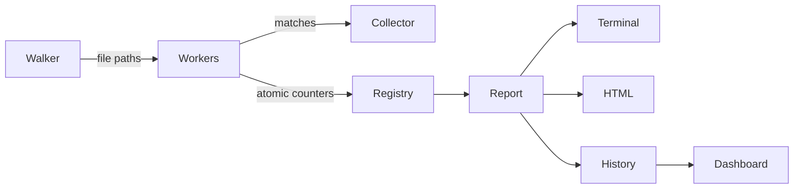

# scope

**A local-first Go codebase explorer with structural search and visible
search-performance profiling.**

[](https://pkg.go.dev/github.com/Viswesh-G/scope)
[](https://github.com/Viswesh-G/scope/actions/workflows/ci.yml)
[](https://github.com/Viswesh-G/scope/releases/latest)
[](LICENSE)
[](https://goreportcard.com/report/github.com/Viswesh-G/scope)

Most search tools answer one question: *where is this string?*

`scope` answers that, and then keeps going. It tells you how long the search
took, how the work was split across CPU cores, which files are the hotspots,
and what your repository actually looks like structurally. Everything runs on
your machine. Scope does not upload repository contents or usage telemetry.
Go may download missing module dependencies according to your Go environment.

```bash
go install github.com/Viswesh-G/scope@latest
cd your-go-project
scope search -p "context.Context" --path ./internal --workers 4
scope ast --type func --name "Run*"
```

`scope refs` follows Go's type information, so it finds references to the
selected declaration rather than every identifier with the same spelling. If a
name is ambiguous, narrow it with `--file` and `--line`.

---

## Table of contents

- [Why this exists](#why-this-exists)
- [What you actually see](#what-you-actually-see)
- [Install](#install)
- [The four things it does](#the-four-things-it-does)
- [Command overview](#command-overview)
- [Being honest about ripgrep](#being-honest-about-ripgrep)
- [Architecture](#architecture)
- [Development](#development)
- [Roadmap](#roadmap)
- [Feedback and project health](#feedback-and-project-health)
- [Contributing](#contributing)
- [License](#license)

---

## Why this exists

I wanted a search tool I could actually learn concurrency from. Every other
option was a black box: you type a pattern, results come out, and you have no
idea what happened in between.

So `scope` instruments itself. Every search prints a breakdown of the work:
how many directories and files were walked, how many matches turned up, how
much CPU time each worker burned, how evenly the files were distributed, and
whether the parallelism actually paid off. When something feels slow, you can
dump a real pprof profile and look at a flame graph instead of guessing.

It grew from there. Once the tool already understood your files and kept a
history of what you searched for, structural search, repository audits, and a
live dashboard were natural things to add.

---

## What you actually see

A normal search prints the matches, then the telemetry. This shortened
transcript came from a real search of Scope's `internal/ignore` package; your
counts and timings will differ:

```bash
scope search -p "ShouldSkip" --path internal/ignore --workers 2
```

```text
Scope Metrics
Dirs Scanned  : 1
Files Scanned : 3
Files Ignored : 0
Matches Found : 14
Walk Time     : 0s
Search Time   : 43.1104ms
Total Time    : 22.5599ms
Parallelism   : 1.91x
Concurrency: Good

Worker Stats:
  Worker 0   67% files scanned
  work: 22.5599ms   files: 2   matches: 3   size: 4.0 KB
  throughput: 177.9 KB/s
  Worker 1   33% files scanned
  work: 20.5505ms   files: 1   matches: 11  size: 4.1 KB
  throughput: 201.1 KB/s

Load Balance
────────────────────
Max Worker Load : 2 files  /  4.1 KB
Min Worker Load : 1 files  /  4.0 KB
Imbalance       : 2.00x
```

`Search Time` is summed worker time, so it can be longer than wall-clock
`Total Time` when workers run in parallel. `Parallelism` is summed worker time
divided by wall-clock time. These are workload observations, not controlled
benchmarks; use `scope compare` for repeated, recorded comparisons.

There is also a terminal UI and a browser dashboard if you would rather not
read tables.

---

## Install

Requires Go 1.25.6 or newer.

```bash
# from source (recommended)
go install github.com/Viswesh-G/scope@latest
```

Prebuilt Linux, macOS, and Windows archives with checksums are available from
the [releases page](https://github.com/Viswesh-G/scope/releases) after a tagged
release is published. Until then, build from source with the command above.

<details>
<summary>Build from a checkout</summary>

```bash
make build   # produces ./scope and ./scp
make test
make check
```

</details>

### About the command name

The binary is called **`scope`**. An earlier version shipped as `scp`, which
turned out to be a bad idea: it shadows the OpenSSH `scp` command that already
exists on nearly every machine, and it made the project impossible to find by
searching for it.

`scp` still works as an alias, so nothing breaks if you have muscle memory for
it, but new installs get `scope`.

---

## The four things it does

### 1. Find

Literal patterns skip the regex engine entirely and use `strings.Contains`,
which is several times faster. Anything with metacharacters falls back to the
full `regexp` engine.

```bash
scope search -p "TODO"
scope search -p "func main" --path ./cmd -i
scope search -p "error" -C 2                 # context lines
scope search -p "FIXME" -g "*.go" -g "!*_test.go"
cat app.log | scope search -p "FATAL" --path -
scope search -p "error" --json -q | jq '.[].file'
```

Structural search understands Go code instead of matching text in it, so it
does not get confused by a comment that happens to mention a function name:

```bash
scope ast --type func --name "handle*"
scope ast --type struct --path ./internal
scope ast --type interface --name "*er"
scope refs --name Run --path . --file path/to/file.go --line 10
```

Supported AST node types: `func`, `struct`, `interface`, `var`, `const`,
`type`. `refs` requires packages to type-check; package errors are reported
instead of returning guessed matches.

### 2. Understand

```bash
scope audit            # file stats + dependency counts + duplicate detection
scope stats            # files by extension
scope deps             # Go import frequency
scope dupes            # byte-identical files, by SHA-256
scope graph            # directory tree
scope graph --dot | dot -Tsvg > graph.svg
```

### 3. Measure

```bash
scope search -p "func" --profile              # .scope/cpu.pprof + mem.pprof
scope search -p "func" --parallel-profile    # ASCII worker timeline
scope compare -p "github" --runs 20 --warmup 3 --workers 4 \
  --save .scope/benchmarks/github.json
```

`compare` runs both `scope` and `rg` against the same pattern, alternating who
goes first and discarding warmup rounds. It records tool versions, environment
and repository metadata, per-run match counts, and raw latency samples in an
optional JSON file. Warmups only try to prime the OS file cache; they do not
provide a cold-cache measurement. Scope and ripgrep apply different ignore
rules, so `compare` displays the policy differences and warns if match counts
do not agree or are unstable between runs. Regex and glob syntax can differ
too. Treat timings as exploratory, not as a CI performance gate, unless the
runner is controlled and thresholds are based on measured noise.

### 4. Monitor

```bash
scope watch -p "TODO"      # re-runs the search on every file change
scope tui                  # interactive terminal UI
scope serve                # local web dashboard with live SSE updates
```

Searches are recorded to `.scope/history.json` (capped at 1000 entries):

```bash
scope history              # recent searches
scope history top          # your most-used patterns
scope history slowest      # what has been costing you time
scope history replay       # re-run the last one
scope history pattern "TODO"
```

---

## Command overview

| Command | What it does |
| --- | --- |
| `scope search` | The main event. Regex/literal search with metrics, JSON, HTML, and profile output. |
| `scope ast` | Structural search over Go declarations. |
| `scope refs` | Type-aware references to a Go declaration. |
| `scope audit` | One-shot repository health check. |
| `scope stats` | File counts by extension. |
| `scope deps` | Go import frequency. |
| `scope dupes` | Duplicate file detection via SHA-256. |
| `scope graph` | Directory tree or Graphviz DOT output. |
| `scope watch` | Debounced live re-search on file changes. |
| `scope tui` | Bubble Tea terminal interface. |
| `scope serve` | Local HTTP dashboard with Server-Sent Events. |
| `scope compare` | Statistical benchmark against ripgrep. |
| `scope history` | Search history: stats, top, slowest, replay, export. |
| `scope config` | Colors and output settings. |
| `scope ignore` | Manage `.scope-ignore` patterns. |

Full flag reference lives in [`COMMANDS.md`](COMMANDS.md).

---

## Being honest about ripgrep

`rg` is faster than `scope` on most plain literal searches, and it will stay
faster. It is a decade-old project written in Rust with hand-tuned SIMD
matching, and it is excellent at exactly one thing.

`scope` is a different bet. It is a codebase intelligence tool that happens to
contain a search engine, built so you can see and understand what the tool is
doing, and inspect Go structure rather than raw text. If you want the fastest
possible `grep`, use `rg`. If you want to understand a repository and watch how
the work gets done, this is the tool.

If `scope search` ever loses badly on a workload you care about, run
`scope compare` and the numbers will tell you exactly where.

---

## Architecture


```mermaid
flowchart LR
    Walker -->|file paths| Workers
    Workers -->|matches| Collector
    Workers -->|atomic counters| Registry
    Registry --> Report
    Report --> Terminal
    Report --> HTML
    Report --> History
    History --> Dashboard
```

| Package | Responsibility |
| --- | --- |
| `cmd/` | Cobra commands and flag parsing. Thin, no logic. |
| `internal/search/` | Concurrent search pipeline. |
| `internal/walk/` | Shared, cancellable filesystem traversal. |
| `internal/metrics/` | Atomic counters and worker reports. |
| `internal/analysis/` | History, repository stats, duplicates, graphs, benchmarks. |
| `internal/ast/` | Go structural search. |
| `internal/navigation/` | Type-aware Go symbol reference lookup. |
| `internal/output/` | Terminal rendering, colors, HTML reports. |
| `internal/tui/` | Bubble Tea interface. |
| `internal/serve/` | Local HTTP API, SSE, embedded dashboard. |
| `internal/watch/` | Debounced filesystem watching. |
| `internal/ignore/` | Built-in and repository ignore rules. |
| `internal/profiler/` | CPU, memory, and flamegraph output. |

The pipeline is deliberately straightforward: one goroutine walks the tree and
sends paths down a channel, N workers scan files and push matches to another
channel, and a collector renders whatever it receives. No thread pool
abstraction, no plugin system. If you want to understand how the concurrency
works, you can read `internal/search/engine.go` top to bottom and actually get
it.

---

## Development

```bash
make build      # build ./scope and ./scp
make test       # unit tests
make race       # tests under the race detector
make bench      # search microbenchmarks with -benchmem
make cover      # coverage report
make vet        # go vet
make check      # everything CI runs
```

Optional tools, used when present: `rg` for `scope compare`, `graphviz` for
flamegraph SVGs, `govulncheck` for the security scan.

CI runs build, vet, formatting checks, golangci-lint, `govulncheck`, coverage,
and a coverage threshold on Linux and Windows. The race detector runs on Linux.

See [`CONTRIBUTING.md`](CONTRIBUTING.md) for the workflow and conventions.

---

## Roadmap

Scope is intentionally Go-first. The next useful steps are broader type-aware
navigation (callers and impact analysis), repeatable user-tested workflows,
and better machine-readable output for repository analysis. Cross-language
parsers and performance gates are not planned until there is a clear use case
and a controlled way to validate their correctness.

## Feedback and project health

Bug reports and workflow ideas are welcome through
[GitHub Issues](https://github.com/Viswesh-G/scope/issues). A useful report
includes the command, operating system, expected result, and actual result;
do not include private source code or sensitive repository data. Scope does
not send telemetry.

For maintainers, GitHub traffic, release downloads, and substantive issue or
pull-request activity are signals to review, not install or user counts.
Clones can include automation. Avoid analytics that conflict with Scope's
local-first promise.

---

## Contributing

Issues, ideas, and pull requests are all welcome. If you are thinking about
touching `internal/search`, run `make bench` first and after, so a performance
regression does not slip in unnoticed.

The code is written to be readable by someone learning Go, and the comments
explain *why* rather than restating what the line does. Please keep it that
way. A tool whose selling point is that you can read it should stay that way.

---

## License

MIT. See [`LICENSE`](LICENSE).
